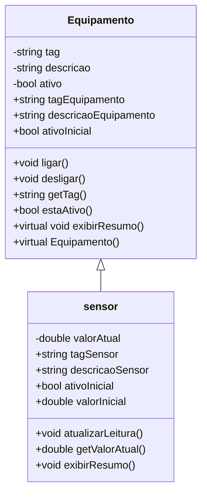

# Exemplo de Documentação UML

## Introdução
A UML (Unified Modeling Language) é uma linguagem de modelagem utilizada para visualizar, especificar, construir e documentar sistemas de software.  
Ela permite representar estruturas como classes, objetos e seus relacionamentos.

## Diagrama de Classes
Abaixo temos um exemplo simples de diagrama de classes usando Mermaid:

